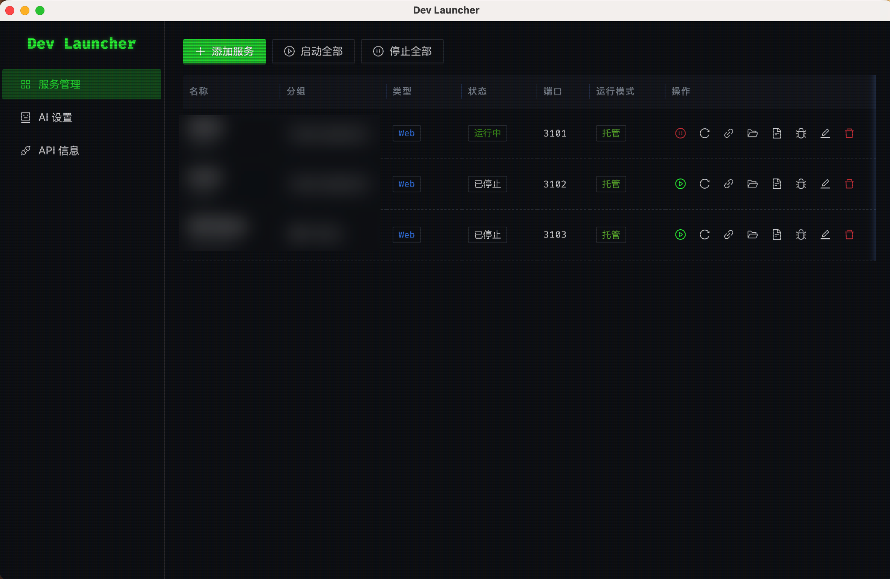

# Dev Launcher

English | [中文](#中文)

Dev Launcher is a local desktop tool for managing development services from one place. It can start and stop local projects, show logs, run health checks, open service URLs, and expose a localhost API for coding agents to register and manage services.

## Features



- Manage local services with commands, working directories, ports, dependencies, and health checks.
- Start services as managed processes or in an external terminal.
- View recent service logs in the desktop UI.
- Open service URLs in the default or a selected browser.
- Expose a local REST API on `127.0.0.1:19527` with Bearer token authentication.
- Register projects through `dev-launcher.service.json`.
- Optional AI diagnostics with OpenAI-compatible providers.

## Tech Stack

- Electron
- TypeScript
- React
- Vite
- Ant Design
- Fastify

## Requirements

- Node.js 20 or newer
- npm

## Development

```bash
npm install
npm run build
npm run dev
```

For a production-style local run:

```bash
npm run build
npm start
```

## Packaging

```bash
npm run dist
```

Build output is written to `release/`.

## Agent Integration

Coding agents can register a project by creating a `dev-launcher.service.json` file in that project and calling the local API. See [AGENT_INTEGRATION.md](AGENT_INTEGRATION.md) for the registration format and API examples.

## Documentation

- [Design notes](DESIGN.md)
- [Agent integration guide](AGENT_INTEGRATION.md)

## Security Notes

- The REST API only listens on `127.0.0.1`.
- API access uses a locally generated Bearer token.
- AI API keys should be provided through environment variables or the app settings, and should not be committed to source control.

## License

MIT

---

## 中文

# Dev Launcher

Dev Launcher 是一个本地桌面开发服务管理工具。它可以统一启动和停止本机项目、查看日志、执行健康检查、打开服务地址，并提供本地 API，方便 coding agent 自动注册和管理开发服务。

## 功能


- 管理本地服务的启动命令、工作目录、端口、依赖和健康检查。
- 支持托管进程启动，也支持在外部终端中启动。
- 在桌面界面中查看最近的服务日志。
- 使用默认浏览器或指定浏览器打开服务地址。
- 在 `127.0.0.1:19527` 暴露本地 REST API，并使用 Bearer token 鉴权。
- 支持通过 `dev-launcher.service.json` 注册项目。
- 可选 AI 诊断能力，支持 OpenAI 兼容提供方。

## 技术栈

- Electron
- TypeScript
- React
- Vite
- Ant Design
- Fastify

## 环境要求

- Node.js 20 或更新版本
- npm

## 本地开发

```bash
npm install
npm run build
npm run dev
```

以接近生产环境的方式本地运行：

```bash
npm run build
npm start
```

## 打包

```bash
npm run dist
```

打包产物会输出到 `release/`。

## Agent 集成

Coding agent 可以在目标项目中创建 `dev-launcher.service.json`，然后调用 Dev Launcher 的本地 API 完成注册。注册格式和 API 示例见 [AGENT_INTEGRATION.md](AGENT_INTEGRATION.md)。

## 文档

- [设计说明](DESIGN.md)
- [Agent 集成指南](AGENT_INTEGRATION.md)

## 安全说明

- REST API 只监听 `127.0.0.1`。
- API 访问使用本地生成的 Bearer token。
- AI API Key 应通过环境变量或应用设置提供，不应提交到源码仓库。

## 许可证

MIT
